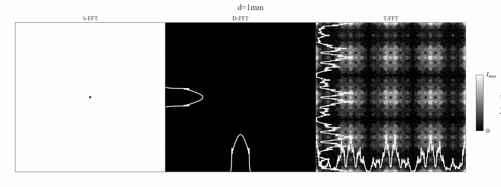

# Fresnel Diffraction Simulation in MATLAB / MATLAB 菲涅尔衍射仿真

A compact MATLAB toolkit that numerically propagates a **Laguerre–Gaussian (LG) vortex beam** through an annular aperture and compares the three standard FFT-based Fresnel propagation schemes side by side.

一个轻量级 MATLAB 光学仿真工具包：数值模拟**拉盖尔-高斯（LG）涡旋光束**通过环形孔径后的衍射传播，并对三种经典的 FFT 菲涅尔传播算法做并排对比。

---

## Features / 主要特性

- Three propagation methods under one unified interface:
  - **S-FFT** — single-FFT (convolution) approach; output window scales with propagation distance.
  - **T-FFT** — transfer-function FFT approach; output window equals input window.
  - **D-FFT** — angular-spectrum approach; unitary propagation, evanescent waves filtered out.
- Analytic **Laguerre–Gaussian beam** generator with radial order `p` and azimuthal index `l`, including Gouy phase, spherical wavefront and helical phase factor.
- **Annular / circular aperture** mask generator.
- Publication-ready three-panel comparison figure with overlaid 1-D intensity profiles (`x` and `y`) and a shared colorbar.
- One-click GIF generation of the propagation sequence.

三种传播算法统一在同一个函数接口下：
- **S-FFT** —— 单次 FFT（卷积）法，输出面尺寸随传播距离自动扩展。
- **T-FFT** —— 传递函数 FFT 法，输出面与输入面同尺寸。
- **D-FFT** —— 角谱法，幺正传播，自动滤除倏逝波。
- 解析形式的**拉盖尔-高斯光束**生成器，支持径向阶数 `p` 和角向量子数 `l`，包含古伊相位、球面波前与螺旋相位因子。
- **环形 / 圆孔**掩膜生成器。
- 可直接用于论文的三联对比图，叠加一维 `x` / `y` 强度剖面，并配共享 colorbar。
- 一键导出传播序列 GIF 动画。

---

## Repository Structure / 文件结构

| File | Description | 说明 |
|------|-------------|------|
| `main.m` | Main script: sets parameters, builds aperture + beam, loops over propagation distances and methods, renders figure and writes GIF. | 主脚本：设置参数、构造孔径与入射光、循环传播距离与三种方法、出图并写 GIF。 |
| `LG_beam.m` | Analytic Laguerre–Gaussian complex field `E(r, θ, z; p, l)`. | 解析形式的拉盖尔-高斯复振幅 `E(r, θ, z; p, l)`。 |
| `annular_hole.m` | Binary annular / circular aperture mask on an `N × N` grid. | 在 `N × N` 网格上生成环形 / 二元圆孔掩膜。 |
| `makegrid.m` | Utility: build `x` / `y` coordinate vectors from resolution and pixel pitch. | 工具函数：根据分辨率和像素间距生成 `x` / `y` 坐标向量。 |
| `show_LG_beam.m` | Standalone demo script: renders a higher-order LG beam (`p = 2, l = 3`) with the `lambda2rgb` colormap and overlaid 1-D profiles. | 独立演示脚本：用 `lambda2rgb` 色图绘制高阶 LG 光束（`p = 2, l = 3`）并叠加一维剖面。 |
| `propagate.m` | Unified propagation routine. Method selected via `'Method','S-FFT' / 'T-FFT' / 'D-FFT'`. | 统一传播函数，通过 `'Method','S-FFT' / 'T-FFT' / 'D-FFT'` 选择算法。 |
| `show_results.m` | Three-panel side-by-side rendering with shared colorbar. | 三联并排渲染，共享 colorbar。 |
| `intensity_1D_profile.m` | Overlays normalized 1-D intensity cross-sections (`x`, `y`, or `xy`) on a 2-D intensity plot. | 在二维强度图上叠加归一化一维强度剖面（`x` / `y` / `xy`）。 |
| `GIF_generator.m` | Appends the current figure to an animated GIF. | 将当前帧追加写入 GIF 动画。 |
| `diffraction.gif` | Sample output: LG beam through an aperture propagating over 1–150 mm. | 示例输出：LG 光束过孔径后在 1–150 mm 距离内的传播动画。 |
| `G.gif` | Additional sample output. | 另一份示例动画。 |

---

## Quick Start / 快速开始

Run the main script in MATLAB:

在 MATLAB 中直接运行主脚本：

```matlab
>> main
```

This will:

1. Build a 512 × 512 sampling grid over a 5 mm window.
2. Generate a `p = 0, l = 0` (fundamental Gaussian) beam at λ = 632.8 nm with waist `w = 0.5 mm`, clipped by an outer-radius `0.3 mm` circular aperture.
3. Propagate the field to 20 distances from `d = 1 mm` to `d = 150 mm` using S-FFT, T-FFT and D-FFT.
4. Render the three-panel comparison and append each frame to `diffraction.gif`.

执行后将：

1. 在 5 mm 视场内建立 512 × 512 采样网格。
2. 生成 λ = 632.8 nm、束腰 `w = 0.5 mm`、`p = 0, l = 0`（基模高斯）光束，被外径 `0.3 mm` 的圆孔截取。
3. 用 S-FFT、T-FFT、D-FFT 三种方法把光场传播到 `d = 1 mm` 到 `d = 150 mm` 的 20 个距离上。
4. 渲染三联对比图，并把每一帧追加写入 `diffraction.gif`。

---

## Usage / 用法

### Propagate a field / 传播一个光场

```matlab
[U, x, y] = propagate(U0, x0, y0, lambda, d, 'Method', 'D-FFT');
```

| Argument | Meaning | 含义 |
|----------|---------|------|
| `U0` | Input complex field on `(x0, y0)` | 输入面复振幅，定义在 `(x0, y0)` 上 |
| `x0, y0` | Input coordinate vectors | 输入面坐标向量 |
| `lambda` | Wavelength (same length unit as `x0`, `d`) | 波长（与 `x0`、`d` 同单位） |
| `d` | Propagation distance | 传播距离 |
| `'Method'` | `'S-FFT'`, `'T-FFT'` or `'D-FFT'` (case-insensitive) | 传播方法，不区分大小写 |
| `U, x, y` | Output complex field and its coordinates | 输出面复振幅及其坐标 |

### Generate an LG beam / 生成 LG 光束

```matlab
E = LG_beam(r, theta, z, beam_waist, lambda, dx, dy, p, l);
```

### Build an aperture / 生成孔径

```matlab
A = annular_hole(inner_radius, outer_radius, N, L);
```

---

## Notes on the Three Methods / 三种算法说明

| Method | Output window | Strengths | Caveats |
|--------|---------------|-----------|---------|
| **S-FFT** | `L_out = N · λ · d / L0`, grows linearly with `d` | Single FFT, fast; natural Fraunhofer scaling | Output pixel size changes with `d`; fixed input sampling may alias at very short `d`. |
| **T-FFT** | Same as input, `L_out = L0` | Inverse FFT only once per step; same sampling as input | Accurate only when the Fresnel approximation holds on the same grid; prone to aliasing at long distances. |
| **D-FFT** | Same as input, `L_out = L0` | Angular spectrum is unitary; most accurate over moderate distances; evanescent waves discarded via `max(arg, 0)`. | Not truly "Fraunhofer scaling"; grid size fixed. |

| 方法 | 输出面尺寸 | 优点 | 注意事项 |
|------|-----------|------|----------|
| **S-FFT** | `L_out = N · λ · d / L0`，随 `d` 线性增大 | 单次 FFT，速度快，自然对应夫琅禾费标度 | 输出像元尺寸随 `d` 变化；距离过短时固定输入采样可能混叠。 |
| **T-FFT** | 与输入面相同，`L_out = L0` | 每步只需一次逆 FFT，采样与输入一致 | 仅在菲涅尔近似成立、网格不变时准确；距离过远易混叠。 |
| **D-FFT** | 与输入面相同，`L_out = L0` | 角谱传递函数模长为 1，幺正变换，中等距离下最准确；`max(arg,0)` 滤除倏逝波。 | 不具备夫琅禾费标度，网格尺寸固定。 |

---

## Example / 示例

With the default parameters in `main.m` (λ = 632.8 nm, `w = 0.5`, `N = 512`, `L0 = 5`, outer radius `0.3`), running `main` produces an animated GIF comparing the three methods at every propagation distance:

使用 `main.m` 中的默认参数（λ = 632.8 nm、`w = 0.5`、`N = 512`、`L0 = 5`、外径 `0.3`），运行 `main` 会输出一份 GIF，在每个传播距离上并排对比三种算法：



---

## Requirements / 环境要求

- MATLAB R2021b or later (uses `clim`, string arrays, `gobjects`, `tiled`/`subplot` `'Position'`-based layout).
- No additional toolboxes required.

- MATLAB R2021b 或更新版本（用到了 `clim`、字符串数组、`gobjects`、基于 `'Position'` 的子图布局）。
- 无需额外工具箱。

---

## License / 许可证

This project is released under the **MIT License** — feel free to use, modify and distribute it, with attribution.

本项目采用 **MIT 许可证**发布 —— 可自由使用、修改与分发，保留出处即可。
